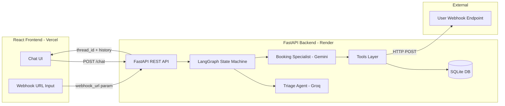
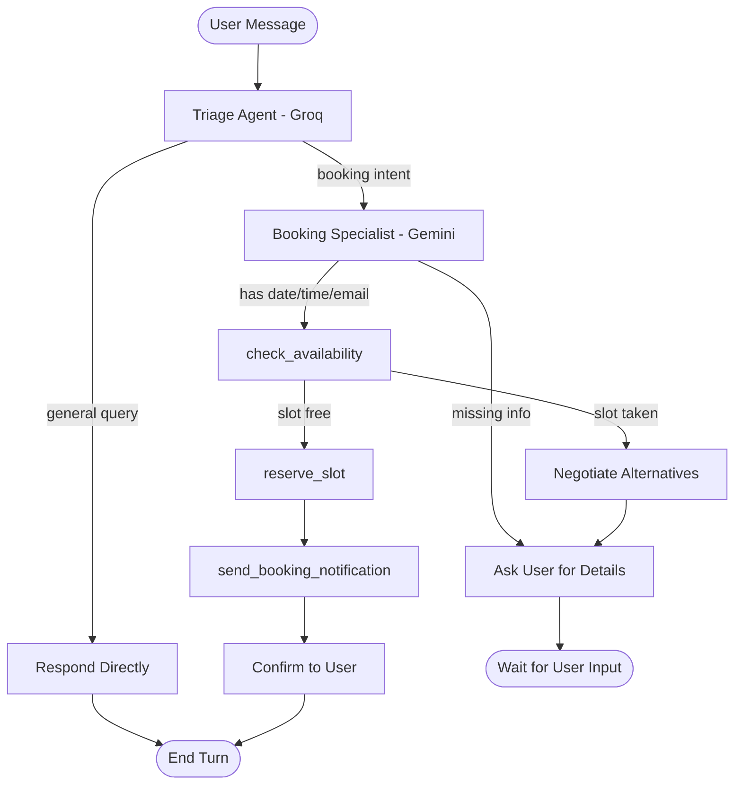

# Assignment 2: Multi-Agent Scheduling Assistant

## Plan Overview

A multi-agent workflow built with **LangGraph** that orchestrates a **Triage Agent** (Groq) and a **Booking Specialist** (Gemini) to handle calendar bookings and trigger external actions. The backend is **FastAPI** with SQLite-backed conversation persistence, and the frontend is **React**. The backend deploys to **Render** and the frontend to **Vercel**.

### Confirmed Architecture Decisions

| Decision | Choice |
|----------|--------|
| Triage Agent LLM | **Groq** (fast routing) |
| Booking Specialist LLM | **Google Gemini** (reasoning/negotiation) |
| Backend hosting | **Render** (free tier) |
| Frontend hosting | **Vercel** (free tier) |
| Notification webhook | **User-configurable** — the frontend lets the user paste their own webhook URL (e.g. Webhook.site / Pipedream), which is sent to the backend per request |
| State persistence | **SQLite Saver** (LangGraph `SqliteSaver`) |
| Slot storage | **SQLite** (in-memory fallback for local dev) |

---

## System Architecture



## Agent Workflow (LangGraph State Machine)



---

## Phase 1: Project Scaffolding & Dependencies

**Goal:** Set up the monorepo structure, virtual environment, and all dependency manifests.

### 1.1 Directory Structure

```
d:/ASSIGNMENT-2/
├── backend/
│   ├── app/
│   │   ├── __init__.py
│   │   ├── main.py              # FastAPI app entry
│   │   ├── config.py            # Settings/env loading
│   │   ├── graph.py             # LangGraph state machine definition
│   │   ├── state.py             # TypedDict state schema
│   │   ├── agents/
│   │   │   ├── __init__.py
│   │   │   ├── triage.py        # Triage Agent (Groq)
│   │   │   └── booking.py       # Booking Specialist (Gemini)
│   │   ├── tools/
│   │   │   ├── __init__.py
│   │   │   ├── availability.py  # check_availability
│   │   │   ├── reserve.py       # reserve_slot
│   │   │   └── notify.py        # send_booking_notification
│   │   ├── db.py                # SQLite init + slot storage
│   │   └── schemas.py           # Pydantic request/response models
│   ├── requirements.txt
│   ├── render.yaml              # Render deployment config
│   └── .env                     # local env (gitignored)
├── frontend/
│   ├── src/
│   │   ├── App.jsx
│   │   ├── main.jsx
│   │   ├── components/
│   │   │   ├── ChatWindow.jsx
│   │   │   ├── MessageBubble.jsx
│   │   │   ├── WebhookInput.jsx
│   │   │   └── ChatInput.jsx
│   │   ├── api/
│   │   │   └── client.js
│   │   └── styles/
│   │       └── App.css
│   ├── package.json
│   ├── vite.config.js
│   ├── vercel.json
│   └── .env.local               # VITE_API_URL (gitignored)
├── .env                         # root env (gitignored)
├── plan.md                      # this file
└── README.md
```

### 1.2 Backend Dependencies (`backend/requirements.txt`)

- `fastapi`
- `uvicorn[standard]`
- `langgraph` (with `langgraph-checkpoint-sqlite`)
- `langchain-core`
- `langchain-groq` (Groq LLM for Triage)
- `langchain-google-genai` (Gemini for Booking Specialist)
- `pydantic`
- `pydantic-settings`
- `python-dotenv`
- `httpx` (for webhook HTTP calls)
- `sqlite3` (stdlib, no install needed)
- `python-dateutil` (relative date resolution)

### 1.3 Frontend Dependencies (`frontend/package.json`)

- `react`, `react-dom`
- `vite`, `@vitejs/plugin-react`
- `axios` (API calls)
- `react-markdown` (render agent responses)

### 1.4 Environment Variables

**`backend/.env`** (and Render env vars):
- `GROQ_API_KEY` — already present in root `.env`
- `GOOGLE_API_KEY` — already present in root `.env`
- `DATABASE_URL` — Render-disk SQLite path (optional; defaults to `./data/app.db`)
- `CORS_ORIGINS` — comma-separated allowed origins (Vercel URL)

**`frontend/.env.local`** (and Vercel env vars):
- `VITE_API_URL` — Render backend URL

### Tasks

- [ ] Create `backend/` and `frontend/` directories with the structure above
- [ ] Write `backend/requirements.txt` with all dependencies
- [ ] Write `frontend/package.json` with Vite + React scaffold
- [ ] Create `.gitignore` (exclude `.env`, `__pycache__`, `node_modules`, `*.db`, `data/`)
- [ ] Create `README.md` with setup instructions

---

## Phase 2: LangGraph State Machine, Agents & Tools

**Goal:** Implement the multi-agent graph, both agents, and the three mocked-but-functional tools.

### 2.1 State Schema (`backend/app/state.py`)

Define a `TypedDict` for the graph state:

- `messages`: `list` — conversation history (LangChain `BaseMessage` list)
- `thread_id`: `str` — unique conversation/session identifier
- `pending_booking`: `dict | None` — tracks in-progress booking `{date, time, email}`
- `webhook_url`: `str | None` — user-provided webhook endpoint for notifications
- `current_agent`: `str` — which agent is active (`"triage"` or `"booking"`)

### 2.2 Triage Agent (`backend/app/agents/triage.py`)

- **LLM:** Groq (`langchain-groq`, model `llama-3.3-70b-versatile` or similar)
- **Role:** Analyze the user message and decide routing:
  - If the query is general (greeting, FAQ, small talk) → respond directly and end turn.
  - If the user expresses intent to schedule, check, or book an appointment → route to Booking Specialist.
- **Implementation:** A node function that calls the Groq LLM with a system prompt instructing it to either answer or emit a routing signal. Uses structured output / tool-calling to signal `"route_to_booking"` vs `"respond_directly"`.

### 2.3 Booking Specialist (`backend/app/agents/booking.py`)

- **LLM:** Google Gemini (`langchain-google-genai`, model `gemini-1.5-flash` or `gemini-2.0-flash`)
- **Role:** Manage calendar tool execution, track slot details, prompt for missing info, negotiate alternatives.
- **Key behaviors:**
  - **Input Normalization:** Before calling any tool, resolve relative dates ("tomorrow", "next Monday") to absolute `YYYY-MM-DD` using `python-dateutil` + current date. Validate time formats (`HH:MM`).
  - **Missing Info Prompting:** If `date`, `time`, or `email` is missing, ask the user and wait (end turn).
  - **Negotiation:** If `check_availability` returns the slot is taken, propose the next 2–3 available slots and ask the user to pick.
  - **Tool Binding:** Bind the three tools (`check_availability`, `reserve_slot`, `send_booking_notification`) to the Gemini model so it can call them via LangGraph's tool node.

### 2.4 Tools (`backend/app/tools/`)

#### `check_availability(date: str) -> dict`
- Queries the SQLite `slots` table for the given date.
- Returns `{"available": bool, "taken_slots": [...], "free_slots": [...]}` for standard time windows (e.g., 09:00–17:00, 1-hour slots).
- Mock seed data: pre-populate a few taken slots so negotiation is demonstrable.

#### `reserve_slot(date: str, time: str, email: str) -> dict`
- Inserts a row into the SQLite `slots` table (unique constraint on `date + time`).
- Returns `{"success": bool, "message": str}`.
- If the slot is already taken, returns failure so the agent can negotiate.

#### `send_booking_notification(email: str, details: str) -> dict`
- Performs an HTTP POST (via `httpx`) to the user-provided `webhook_url` with a JSON payload `{"email": ..., "details": ...}`.
- If no `webhook_url` is set, logs the notification and returns a mock-success.
- Returns `{"success": bool, "status_code": int, "message": str}`.

### 2.5 Graph Definition (`backend/app/graph.py`)

- Build a `StateGraph` with nodes: `triage`, `booking`, `tools`.
- **Edges:**
  - `START` → `triage`
  - `triage` → conditional edge:
    - if routing to booking → `booking`
    - if responding directly → `END`
  - `booking` → conditional edge:
    - if tool call needed → `tools`
    - if asking user / done → `END`
  - `tools` → `booking` (loop back after tool execution)
- Compile the graph with `SqliteSaver` as the checkpointer (thread-based memory).

### Tasks

- [ ] Implement `state.py` with the `TypedDict` state schema
- [ ] Implement `triage.py` (Groq-based routing node)
- [ ] Implement `booking.py` (Gemini-based booking node with date normalization)
- [ ] Implement `tools/availability.py`, `tools/reserve.py`, `tools/notify.py`
- [ ] Implement `graph.py` wiring all nodes + edges + SqliteSaver checkpointer
- [ ] Write a quick local test script to validate the graph end-to-end

---

## Phase 3: FastAPI Backend with Persistence

**Goal:** Expose the LangGraph workflow over a REST API with SQLite-backed conversation persistence.

### 3.1 Database Layer (`backend/app/db.py`)

- Initialize SQLite database at `DATABASE_URL` (or `./data/app.db` locally).
- Create `slots` table: `id, date, time, email, created_at` with `UNIQUE(date, time)`.
- Seed a few mock-taken slots on first run.
- Provide helper functions for the tools to query/insert.

### 3.2 LangGraph Persistence

- Use `langgraph.checkpoint.sqlite.SqliteSaver` (or async variant) connected to the same SQLite DB.
- Each conversation keyed by `thread_id` (generated client-side or server-side on first message).
- Conversation history survives server restarts because it's persisted to SQLite.

### 3.3 API Endpoints (`backend/app/main.py`)

| Method | Path | Description |
|--------|------|-------------|
| `POST` | `/api/chat` | Send a message; body `{thread_id, message, webhook_url?}`. Returns `{thread_id, reply, pending_booking?}`. |
| `GET` | `/api/history/{thread_id}` | Retrieve full conversation history for a thread. |
| `POST` | `/api/thread` | Create a new thread; returns `{thread_id}`. |
| `GET` | `/api/health` | Health check for Render. |

- **CORS:** Enable `CORSMiddleware` with origins from `CORS_ORIGINS` env var (Vercel URL).
- **Streaming (optional):** Use FastAPI `StreamingResponse` with LangGraph's stream events for token-by-token output. (Start with non-streaming for simplicity; add streaming if time permits.)

### 3.4 Pydantic Schemas (`backend/app/schemas.py`)

- `ChatRequest`: `thread_id: str`, `message: str`, `webhook_url: str | None`
- `ChatResponse`: `thread_id: str`, `reply: str`, `pending_booking: dict | None`
- `HistoryResponse`: `thread_id: str`, `messages: list`

### Tasks

- [ ] Implement `db.py` (SQLite init, slots table, seed data, helpers)
- [ ] Implement `schemas.py` (Pydantic models)
- [ ] Implement `config.py` (settings via `pydantic-settings`)
- [ ] Implement `main.py` (FastAPI app, CORS, endpoints, wire to compiled graph)
- [ ] Test endpoints locally with `uvicorn` + `curl`/Postman
- [ ] Verify conversation persistence across server restarts

---

## Phase 4: React Frontend

**Goal:** Build a chat UI that talks to the FastAPI backend and lets users configure their webhook URL.

### 4.1 Components

- **`App.jsx`**: Top-level layout, manages `thread_id` state, webhook URL state, message list.
- **`ChatWindow.jsx`**: Scrollable message list; renders agent + user messages.
- **`MessageBubble.jsx`**: Renders a single message with markdown support (`react-markdown`).
- **`ChatInput.jsx`**: Text input + send button; calls `/api/chat`.
- **`WebhookInput.jsx`**: Input field where the user pastes their webhook URL (Webhook.site / Pipedream). Stored in component state and sent with each chat request. Includes a "Test Webhook" button that fires a test payload.

### 4.2 API Client (`frontend/src/api/client.js`)

- `sendMessage(threadId, message, webhookUrl)` → POST `/api/chat`
- `getHistory(threadId)` → GET `/api/history/{threadId}`
- `createThread()` → POST `/api/thread`
- Base URL from `import.meta.env.VITE_API_URL`.

### 4.3 UX Flow

1. On load, app calls `createThread()` to get a `thread_id` (or reuses one from `localStorage`).
2. User types a message and sends.
3. If the user has set a webhook URL, it's included in the request.
4. Agent reply is appended to the chat. If the agent asks for missing info, the user continues typing.
5. Conversation history persists via `thread_id` — refreshing the page reloads history via `getHistory`.

### Tasks

- [ ] Scaffold Vite + React project in `frontend/`
- [ ] Implement `api/client.js`
- [ ] Implement `App.jsx` with thread + webhook state management
- [ ] Implement `ChatWindow.jsx` + `MessageBubble.jsx`
- [ ] Implement `ChatInput.jsx`
- [ ] Implement `WebhookInput.jsx` with test button
- [ ] Add basic styling (`App.css`)
- [ ] Test locally against running FastAPI backend

---

## Phase 5: Deployment

**Goal:** Deploy backend to Render and frontend to Vercel, both on free tiers.

### 5.1 Backend — Render

- **`backend/render.yaml`** (Blueprint):
  - Service type: Web Service
  - Runtime: Python 3
  - Build command: `pip install -r requirements.txt`
  - Start command: `uvicorn app.main:app --host 0.0.0.0 --port $PORT`
  - Env vars: `GROQ_API_KEY`, `GOOGLE_API_KEY`, `CORS_ORIGINS` (Vercel URL)
  - Disk: Render free tier supports ephemeral disk; SQLite DB will reset on redeploy. For true persistence, use Render's persistent disk (paid) or switch to an external SQLite host. Document this limitation.
- **Alternative for persistence on free tier:** Use Render's free PostgreSQL (90-day trial) or keep SQLite on a persistent disk if available. Note this in README.

### 5.2 Frontend — Vercel

- **`frontend/vercel.json`**:
  - Framework: Vite
  - Build command: `npm run build`
  - Output dir: `dist`
  - Env var: `VITE_API_URL` = Render backend URL
- Deploy via Vercel CLI or GitHub integration.

### 5.3 Post-Deployment

- Update `CORS_ORIGINS` on Render with the Vercel domain.
- Update `VITE_API_URL` on Vercel with the Render domain.
- Test end-to-end: create a thread, chat, book a slot, trigger webhook.

### Tasks

- [ ] Write `backend/render.yaml`
- [ ] Write `frontend/vercel.json`
- [ ] Deploy backend to Render; set env vars
- [ ] Deploy frontend to Vercel; set env vars
- [ ] Cross-configure CORS and API URL
- [ ] End-to-end smoke test on deployed URLs
- [ ] Write final `README.md` with deployment + usage instructions

---

## Key Technical Notes

1. **Date Normalization:** The Booking Specialist resolves relative dates ("tomorrow", "next Friday", "in 3 days") to absolute `YYYY-MM-DD` using `python-dateutil`'s `relativedelta` and the current UTC/IST date before any tool call. This is enforced in the agent's system prompt and validated in the tool layer.

2. **Negotiation Flow:** When `check_availability` reports a slot is taken, the agent receives the list of free slots and proposes alternatives to the user rather than failing. The graph loops back to the user (ends turn) until the user confirms a new slot.

3. **Webhook Flexibility:** The webhook URL is user-supplied via the frontend (not hardcoded). The backend forwards it through the graph state to `send_booking_notification`. If empty, the tool logs and returns mock success.

4. **Persistence:** LangGraph `SqliteSaver` stores conversation checkpoints keyed by `thread_id`. The `slots` table stores bookings. Both live in the same SQLite DB. On Render free tier, the filesystem is ephemeral — document this and recommend a persistent disk or external DB for production use.

5. **LLM Fallback:** If Groq is rate-limited, the Triage Agent can fall back to Gemini (configurable). Keep this as a future enhancement.

---

## Execution Order Summary

| Phase | Focus | Key Deliverable |
|-------|-------|-----------------|
| 1 | Scaffolding | Repo structure + dependency manifests |
| 2 | LangGraph + Agents + Tools | Working state machine with mocked tools |
| 3 | FastAPI + Persistence | REST API with SQLite-backed memory |
| 4 | React Frontend | Chat UI with webhook configuration |
| 5 | Deployment | Live app on Render + Vercel |
